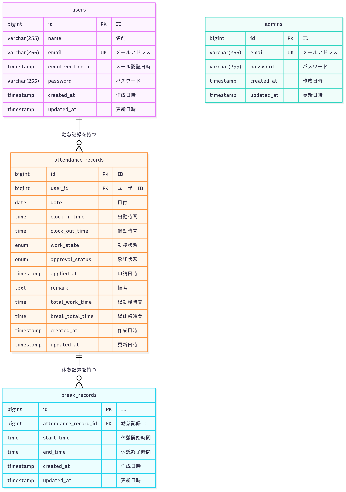

# COACHTECH 勤怠管理アプリ

これは、COACHTECHの模擬案件で作成した勤怠管理アプリケーションです。

## ✨ 機能一覧

### 一般ユーザー機能

- 会員登録(メール認証)、ログイン・ログアウト機能
- 出勤・退勤打刻機能
- 休憩開始・終了打刻機能
- 勤怠一覧表示機能
- 勤怠詳細表示・修正申請機能
- 修正申請一覧表示機能

### 管理者機能

- 管理者ログイン・ログアウト機能
- スタッフ一覧表示機能
- スタッフ月次勤怠表示機能
- 勤怠一覧表示機能（全ユーザー）
- 修正申請承認機能
- CSV出力機能

## 🚀 技術スタック

- **バックエンド**: Laravel, PHP
- **フロントエンド**: Blade, CSS, JavaScript
- **データベース**: MySQL
- **開発環境**: Docker, Docker Compose
- **コード品質**: Larastan (PHPStan + Laravel), PHP CS Fixer

---

## 💻 環境構築手順

このアプリケーションをローカル環境で起動するための手順です。

### 必須要件

- Docker
- Docker Compose

### セットアップ

1. **リポジトリのクローン**

   ```bash
   git clone https://github.com/hgleam/coachtech-attendance-management.git
   cd coachtech-attendance-management
   ```
2. **.env ファイルの準備**
   `src` ディレクトリにある `.env.example` ファイルをコピーして `.env` ファイルを作成します。

   ```bash
   cp src/.env.example src/.env
   # .env ファイルを編集して、docker-compose.ymlのmysqlコンテナ設定(DB_HOST, DB_DATABASE, DB_USERNAME, DB_PASSWORD)を確認・設定
   # mysqlのサービス名 → .envのDB_HOST
   # MYSQL_DATABASE → .envのDB_DATABASE
   # MYSQL_USER → .envのDB_USERNAME
   # MYSQL_PASSWORD → .envのDB_PASSWORD
   # MAIL_HOST → mailhogのサービス名を設定
   # MAIL_FROM_ADDRESS → メールアドレスを設定(例：test@example.com)
   # MAIL_FROM_NAME → メールアドレスの名前を設定(例：勤怠管理システム)
   ```
3. **Dockerコンテナのビルドと起動**

   ```bash
   docker compose build
   docker compose up -d
   ```
4. **PHP依存パッケージのインストール**

   ```bash
   docker compose exec php composer install
   ```
5. **アプリケーションキーの生成**

   ```bash
   docker compose exec php php artisan key:generate
   ```
6. **データベースのマイグレーションと初期データ投入**
   以下のコマンドで、データベースのテーブル作成と初期データの投入を同時に行います。
   Seederには、動作確認用のユーザー、管理者、勤怠データが含まれています。

   ```bash
   docker compose exec php php artisan migrate --seed
   ```
7. **アプリケーションへのアクセス**
   上記の手順が完了したら、ブラウザで以下のURLにアクセスしてください。

   - アプリケーション: [http://localhost:82](http://localhost:82)
   - phpMyAdmin: [http://localhost:8080](http://localhost:8080)
   - MailHog (メール確認用): [http://localhost:8025](http://localhost:8025)

   MailHogは開発用のメールサーバーです。会員登録時の認証メールなどは、実際のメールボックスではなくMailHogのWeb UIに届きますので、こちらでご確認ください。

### テスト用アカウント

`--seed` オプションでデータベースを初期化すると、以下のテスト用アカウントが作成されます。動作確認に利用してください。

- **一般ユーザーアカウント**

  - メールアドレス: `test@example.com`
  - パスワード: `password!!`
  - 備考: 勤怠データが登録済みの状態です。
- **管理者アカウント**

  - メールアドレス: `admin@example.com`
  - パスワード: `password!!`
  - 備考: 管理者機能にアクセス可能です。

## 🧪 テスト実行方法

このアプリケーションには包括的なテストスイートが含まれています。以下のコマンドでテストを実行できます。

### 全テストの実行

```bash
docker compose exec php php artisan test
```

### 特定のテストクラスの実行

```bash
# 認証関連のテスト
docker compose exec php php artisan test tests/Feature/Auth/

# 勤怠関連のテスト
docker compose exec php php artisan test tests/Feature/AttendanceTest.php

# 管理者関連のテスト
docker compose exec php php artisan test tests/Feature/Admin/
```

### テストカバレッジの確認

```bash
# テストカバレッジレポートの生成
docker compose exec php php artisan test --coverage
```

### テストの種類

- **Feature Tests**: エンドツーエンドの機能テスト
- **Unit Tests**: 個別のクラスやメソッドのテスト
- **Integration Tests**: 複数のコンポーネント間の連携テスト

### 主要なテストケース

- ユーザー認証（ログイン・ログアウト・会員登録）
- 勤怠打刻機能（出勤・退勤・休憩）
- 勤怠一覧・詳細表示
- 修正申請機能
- 管理者機能（スタッフ管理・勤怠管理・承認機能）
- CSV出力機能

---

## ER図



## 📋 主要な画面

### 一般ユーザー画面

- **勤怠打刻画面** (`/attendance`): 出勤・退勤・休憩の打刻
- **勤怠一覧画面** (`/attendance/list`): 月次勤怠データの表示
- **勤怠詳細画面** (`/attendance/{id}`): 個別勤怠の詳細表示・修正申請
- **申請一覧画面** (`/stamp_correction_request/list`): 修正申請の一覧表示

### 管理者画面

- **管理者ログイン画面** (`/admin/login`): 管理者認証
- **スタッフ一覧画面** (`/admin/staff/list`): 全スタッフの一覧表示
- **スタッフ勤怠画面** (`/admin/attendance/staff/{id}`): 個別スタッフの月次勤怠
- **勤怠一覧画面** (`/admin/attendance/list`): 全スタッフの日次勤怠一覧
- **申請一覧画面** (`/stamp_correction_request/list`): 修正申請の一覧・承認

## 🔧 開発・デバッグ

### コード品質チェック

このプロジェクトでは、コード品質を保つために以下のツールを導入しています。

#### Larastan (静的解析)

```bash
# 型チェックとコード品質の分析
docker compose exec php ./vendor/bin/phpstan analyse app --memory-limit=512M --level=5

# 設定ファイル: phpstan.neon
```

#### PHP CS Fixer (コード整形)

```bash
# 未使用のuse文を削除
docker compose exec php ./vendor/bin/php-cs-fixer fix app --rules=no_unused_imports

# テストファイルの未使用のuse文を削除
docker compose exec php ./vendor/bin/php-cs-fixer fix tests --rules=no_unused_imports

# 全体的なコード整形
docker compose exec php ./vendor/bin/php-cs-fixer fix app
```

### ログの確認

```bash
# Laravelログの確認
docker compose exec php tail -f storage/logs/laravel.log

# アプリケーションログの確認
docker compose logs -f php
```

### データベースの操作

```bash
# データベースに直接アクセス
docker compose exec mysql mysql -u laravel_user -p laravel_db
```

### キャッシュのクリア

```bash
# アプリケーションキャッシュのクリア
docker compose exec php php artisan cache:clear
docker compose exec php php artisan config:clear
docker compose exec php php artisan route:clear
docker compose exec php php artisan view:clear
```
